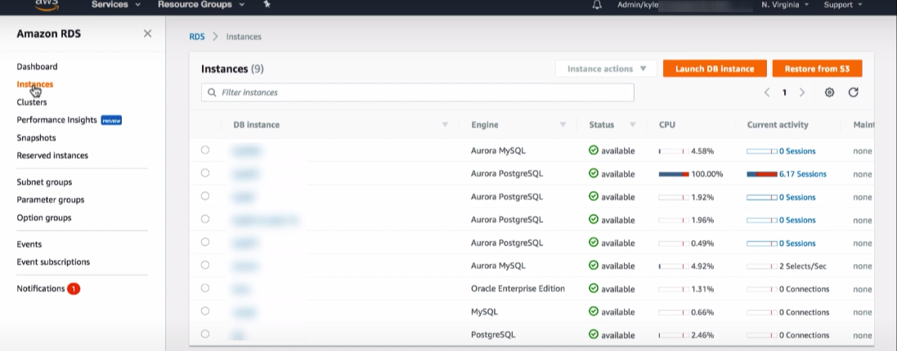

# aws_rds_postqgresql_interview_preparation

here we go !!

## Theorical Questions Section

### Theorical Question 1

why would you use aws rds instead of just putting databases into ec2 instances ?

<b>Answer</b>

https://docs.aws.amazon.com/AmazonRDS/latest/UserGuide/Welcome.html#Welcome.Concepts.RDS

<b>Source</b>

https://docs.aws.amazon.com/AmazonRDS/latest/UserGuide/Welcome.html#Welcome.Concepts.RDS

### Theorical Question 2

how pricing works for aws rds

<b>Answer</b>

This is a database in a ec2 instance managed by aws, the reserved instances also apply here

<b>Source</b>

https://aws.amazon.com/rds/pricing/

### Theorical Question 3

how would you know what type of instance do you need ?

<b>Answer</b>

By cheking the cloudwatch monitoring section in the UI

<b>Source</b>

https://www.youtube.com/watch?v=vXZLUL309ek

### Theorical Question 4

What is the shared responsability model ?

<b>Answer</b>

Amazon RDS is responsible for hosting the software components and infrastructure of DB instances and DB cluster. You are responsible for query tuning, which is the process of adjusting SQL queries to improve performance. Query performance is highly dependent on database design, data size, data distribution, application workload, and query patterns, which can vary greatly. Monitoring and tuning are highly individualized processes that you own for your RDS databases

<b>Source</b>

https://docs.aws.amazon.com/AmazonRDS/latest/UserGuide/Welcome.html#Welcome.Concepts.RDS

### Theorical Question 5

There are new generations of each storage classes coming every often, how can you modify the db instance class ?

<b>Answer</b>

Some modifications result in downtime because Amazon RDS must reboot your DB instance for the change to take effect.

https://docs.aws.amazon.com/AmazonRDS/latest/UserGuide/Overview.DBInstance.Modifying.html

<b>Source</b>

https://docs.aws.amazon.com/AmazonRDS/latest/UserGuide/Welcome.html#Welcome.Concepts.RDS

### Theorical Question 6

what type of instance storage would you use when you need Provisioned IOPS storage is designed to meet the needs of I/O-intensive workloads, particularly database workloads, that require low I/O latency and consistent I/O throughput.?

<b>Answer</b>

Provisioned IOPS SSD – Provisioned IOPS storage is designed to meet the needs of I/O-intensive workloads, particularly database workloads, that require low I/O latency and consistent I/O throughput. Provisioned IOPS storage is best suited for production environments.

<b>Source</b>

https://docs.aws.amazon.com/AmazonRDS/latest/UserGuide/CHAP_Storage.html

### Theorical Question 7

Do you know what these metrics are ?

- IOPS
- Latency
- Throughput
- Queue Depth

<b>Answer</b>

IOPS – The number of I/O operations completed each second. This metric is reported as the average IOPS for a given time interval. Amazon RDS reports read and write IOPS separately on 1-minute intervals. Total IOPS is the sum of the read and write IOPS. Typical values for IOPS range from zero to tens of thousands per second.

Latency – The elapsed time between the submission of an I/O request and its completion. This metric is reported as the average latency for a given time interval. Amazon RDS reports read and write latency separately at 1-minute intervals. Typical values for latency are in milliseconds (ms).

Throughput – The number of bytes each second that are transferred to or from disk. This metric is reported as the average throughput for a given time interval. Amazon RDS reports read and write throughput separately on 1-minute intervals using units of megabytes per second (MB/s). Typical values for throughput range from zero to the I/O channel's maximum bandwidth.

Queue Depth – The number of I/O requests in the queue waiting to be serviced. These are I/O requests that have been submitted by the application but have not been sent to the device because the device is busy servicing other I/O requests. Time spent waiting in the queue is a component of latency and service time (not available as a metric). This metric is reported as the average queue depth for a given time interval. Amazon RDS reports queue depth in 1-minute intervals. Typical values for queue depth range from zero to several hundred

<b>Source</b>

https://docs.aws.amazon.com/AmazonRDS/latest/UserGuide/CHAP_Storage.html

### Theorical Question 8

Do you know what dual stack is ?

<b>Answer</b>

By using dual-stack mode in RDS, resources can communicate with a DB instance over Internet Protocol version 4 (IPv4), Internet Protocol version 6 (IPv6), or both

<b>Source</b>

https://docs.aws.amazon.com/AmazonRDS/latest/UserGuide/Concepts.RDS_Fea_Regions_DB-eng.Feature.DualStackMode.html#Concepts.RDS_Fea_Regions_DB-eng.Feature.DualStackMode.pg

### Theorical Question 9

Do you know what the performance insights are and where to find them is ?

<b>Answer</b>

Performance Insights in Amazon RDS expands on existing Amazon RDS monitoring features to illustrate and help you analyze your database performance. With the Performance Insights dashboard, you can visualize the database load on your Amazon RDS DB instance. You can also filter the load by waits, SQL statements, hosts, or users

In the picture below click where it say session

<b>Source</b>

https://docs.aws.amazon.com/AmazonRDS/latest/UserGuide/Concepts.RDS_Fea_Regions_DB-eng.Feature.DualStackMode.html#Concepts.RDS_Fea_Regions_DB-eng.Feature.DualStackMode.pg

### Theorical Question 10

what is the DB instance RAM recommendations ?

<b>Answer</b>

An Amazon RDS performance best practice is to allocate enough RAM so that your working set resides almost completely in memory. The working set is the data and indexes that are frequently in use on your instance. The more you use the DB instance, the more the working set will grow.

To tell if your working set is almost all in memory, check the ReadIOPS metric (using Amazon CloudWatch) while the DB instance is under load. The value of ReadIOPS should be small and stable. In some cases, scaling up the DB instance class to a class with more RAM results in a dramatic drop in ReadIOPS. In these cases, your working set was not almost completely in memory. Continue to scale up until ReadIOPS no longer drops dramatically after a scaling operation, or ReadIOPS is reduced to a very small amount.

<b>Source</b>

https://docs.aws.amazon.com/AmazonRDS/latest/UserGuide/CHAP_BestPractices.html

### Theorical Question 11

Do you know what the vacuum command is for in posgresql ?

<b>Answer</b>

VACUUM reclaims storage occupied by dead tuples. In normal PostgreSQL operation, tuples that are deleted or obsoleted by an update are not physically removed from their table; they remain present until a VACUUM is done. Therefore it's necessary to do VACUUM periodically, especially on frequently-updated tables.

<b>Source</b>

https://www.postgresql.org/docs/current/sql-vacuum.html

### Theorical Question 12

Do you know what the analize command is for in posgresql ?

<b>Answer</b>

ANALYZE collects statistics about the contents of tables in the database, and stores the results in the pg_statistic system catalog. Subsequently, the query planner uses these statistics to help determine the most efficient execution plans for queries.

<b>Source</b>

https://www.postgresql.org/docs/current/sql-analyze.html

### Theorical Question 13

Do you know what types of scans can you see in the explain command in posgresql ?

<b>Answer</b>

 sequential scans, index scans, and bitmap index scans. There are also non-table row sources, such as VALUES clauses and set-returning functions in FROM, which have their own scan node types. If the query requires joining, aggregation, sorting, or other operations on the raw rows, then there will be additional nodes above the scan nodes to perform these operations.

<b>Source</b>

https://www.postgresql.org/docs/current/sql-analyze.html

### Theorical Question 14

How can you optimize postgreql in aws rds ?

<b>Answer</b>

https://docs.aws.amazon.com/AmazonRDS/latest/UserGuide/CHAP_BestPractices.html#CHAP_BestPractices.PostgreSQL

<b>Source</b>

https://docs.aws.amazon.com/AmazonRDS/latest/UserGuide/CHAP_BestPractices.html#CHAP_BestPractices.PostgreSQL

### Theorical Question 15

How would you filter a query with aggregate ?

<b>Answer</b>

The fundamental difference between WHERE and HAVING is this: WHERE selects input rows before groups and aggregates are computed (thus, it controls which rows go into the aggregate computation), whereas HAVING selects group rows after groups and aggregates are computed. Thus, the WHERE clause must not contain aggregate functions; it makes no sense to try to use an aggregate to determine which rows will be inputs to the aggregates. On the other hand, the HAVING clause always contains aggregate functions. 

<b>Source</b>

https://www.postgresql.org/docs/current/tutorial-agg.html

### Theorical Question 16

How do you know by the cli in postgresql that you are seeing a superuser ?

<b>Answer</b>

<b>Source</b>

https://www.postgresql.org/docs/current/tutorial-agg.html

### Theorical Question 17

Casting is pretty similar to how we do it in snowflake

<b>Answer</b>

<b>Source</b>

https://www.postgresql.org/docs/current/tutorial-agg.html

### Theorical Question 18

What is filter for in postgresql

<b>Answer</b>

<b>Source</b>

https://www.postgresql.org/docs/current/tutorial-agg.html

### Theorical Question 19

What are generated columns in posqgresql

<b>Answer</b>

<b>Source</b>

https://www.postgresql.org/docs/current/tutorial-agg.html

### Theorical Question 20

The primary key section is essential

<b>Answer</b>

<b>Source</b>

https://www.postgresql.org/docs/current/tutorial-agg.html

### Theorical Question 21

Do you know what cascade is for in postgresql

<b>Answer</b>

<b>Source</b>

https://www.postgresql.org/docs/current/tutorial-agg.html

### Theorical Question 22

In postgresql is not necessary to have an authorized view for doing row level security, it has a feature for granting permission in a per row basis

<b>Answer</b>

<b>Source</b>

https://www.postgresql.org/docs/current/tutorial-agg.html

### Theorical Question 23

When do we need a partition in postgresql and when a sequential scan is better than an index

<b>Answer</b>

<b>Source</b>

https://www.postgresql.org/docs/current/tutorial-agg.html

### Theorical Question 24

Well we can have an index per partition and is also important to enable prunning

<b>Answer</b>

<b>Source</b>

https://www.postgresql.org/docs/current/tutorial-agg.html

### Theorical Question 25

Great example of using the explain command for optimizing partitions

<b>Answer</b>

<b>Source</b>

https://www.postgresql.org/docs/current/tutorial-agg.html

